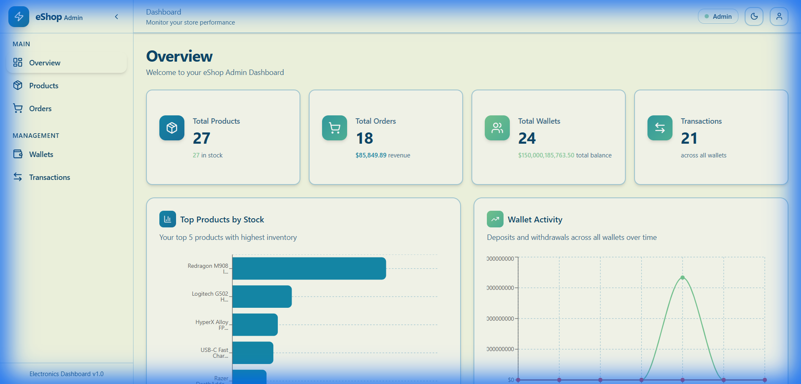
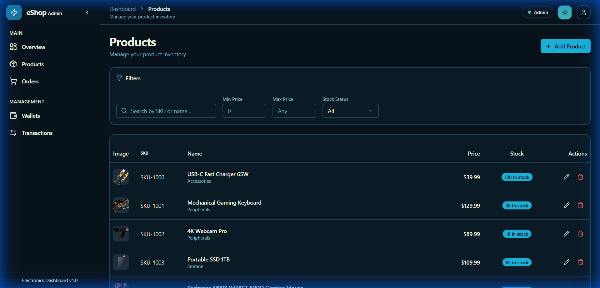

# eShop Admin Dashboard

A full-featured e-commerce admin dashboard built with React, demonstrating CRUD operations, state management, API integration, and modern UI/UX practices.


## 🎯 Project Overview

An admin-only dashboard for managing an e-commerce platform with the following resources:
- **Products** - Full CRUD inventory management
- **Orders** - Create, view, and delete customer orders with automatic stock reduction
- **Wallets** - Create wallets, deposit/withdraw funds with balance protection
- **Transactions** - Global history of all wallet activity

## 🛠️ Tech Stack

| Category | Technology |
|----------|------------|
| **Frontend** | React 19 + Vite |
| **Routing** | React Router 7 |
| **HTTP Client** | Axios |
| **Charts** | Recharts |
| **Styling** | Tailwind CSS 4 + shadcn/ui |
| **State** | React Context API + Hooks |
| **Backend** | JSON Server (mock API) |

## 🔌 API Endpoints

Base URL: `http://localhost:3001`

| Resource | Endpoint | Methods |
|----------|----------|---------|
| Products | `/products` | GET, POST, PATCH, DELETE |
| Orders | `/orders` | GET, POST, DELETE |
| Wallets | `/wallets` | GET, POST, PATCH |
| Transactions | `/walletTransactions` | GET, POST |

## ✨ Features

### Core Features
- ✅ **Products CRUD** - Create, read, update, delete products
- ✅ **Orders Management** - Create orders with automatic stock reduction
- ✅ **Wallet Operations** - Deposit/withdraw with balance validation
- ✅ **Transaction History** - Global view of all wallet activity
- ✅ **Protected Routes** - Authentication guard on dashboard

### Creative Features
- 🌓 **Dark/Light Mode** - Theme toggle with localStorage persistence
- 🔍 **Advanced Search & Filter** - Debounced search, multi-filter support
- 📊 **Interactive Charts** - Recharts with 3 dashboard visualizations

### Form Validation
- Product: SKU required, name required, price ≥ 0, quantity ≥ 0
- Order: Valid email, at least one item, quantity > 0
- Wallet: Amount > 0, withdrawal ≤ balance

### Reusable Components
- `DataTable` - Generic table with sorting and pagination
- `PageHeader` - Consistent page titles with actions
- `ConfirmDeleteDialog` - Reusable delete confirmation
- `SearchFilter` - Search input component
- `LoadingState` / `EmptyState` / `ErrorState` - UI states

## 🚀 Getting Started

### Prerequisites
- Node.js 18+
- npm or yarn

### Installation

```bash
# Clone the repository
git clone <repository-url>
cd e-commerce-admin-dashboard

# Install dependencies
npm install
```

### Running the Application

```bash
# Terminal 1: Start JSON Server (API)
npm run api

# Terminal 2: Start Vite dev server
npm run dev
```

Open [http://localhost:5173](http://localhost:5173) in your browser.

### Demo Credentials
```
Email: admin@eshop.com
Password: admin123
```

## 📁 Project Structure

```
src/
├── components/
│   ├── layout/         # Sidebar, Topbar, DashboardLayout
│   ├── shared/         # Reusable components
│   └── ui/             # shadcn/ui primitives
├── context/            # AuthContext, ThemeContext, SidebarContext
├── pages/
│   ├── Login.jsx
│   ├── NotFound.jsx
│   └── dashboard/      # All dashboard pages
├── services/           # API service layers
└── lib/                # Utilities
```

## 📸 Screenshots

### Dashboard Overview


### Products Management


### Dark Mode


## 📝 License

This project is for educational purposes as part of the Final React Project.

---

Built with ❤️ using React + Vite
